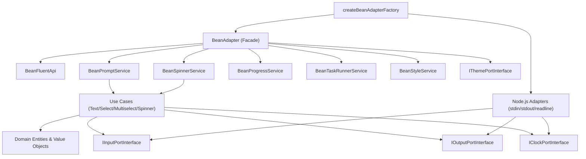
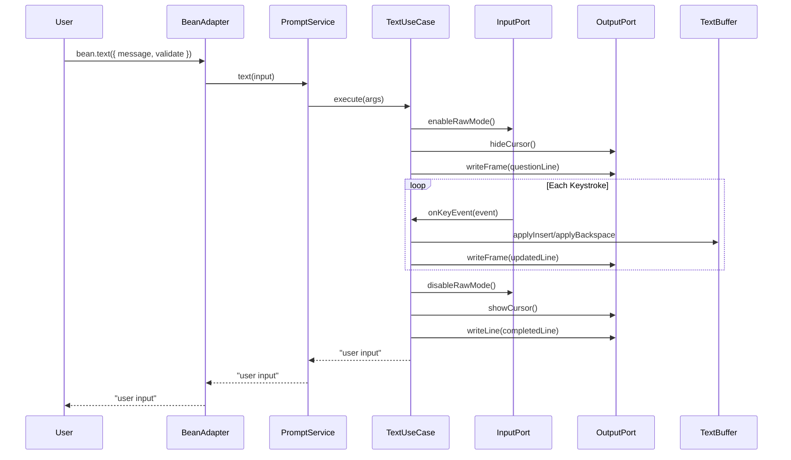

<a id="top"></a>

<p align="center">
  
</p>

<h1 align="center">🫘 Bean</h1>
<p align="center"><em>Zero-dependency terminal interaction library for prompts, spinners, progress bars, task runners, and rich CLI output — built with clean architecture in TypeScript.</em></p>

<p align="center">
    <a aria-label="ElsiKora logo" href="https://elsikora.com">
  
</a>         
</p>

## 💡 Highlights

- 🪶 Truly zero runtime dependencies — everything from ANSI rendering to grapheme segmentation is built in-house, keeping your node_modules lean
- 🎨 All-in-one CLI toolkit replacing chalk + ora + inquirer + listr2 + ink with a single, coherent API surface
- 🏗️ Clean Architecture with injectable ports — swap clock, input, output, editor, and theme adapters for deterministic testing or custom runtimes
- ⚡ Fluent API for chaining prompts, spinners, and output into elegant multi-step workflows with a single expression

## 📚 Table of Contents
- [Description](#-description)
- [Tech Stack](#-tech-stack)
- [Features](#-features)
- [Architecture](#-architecture)
- [Project Structure](#-project-structure)
- [Prerequisites](#-prerequisites)
- [Installation](#-installation)
- [Usage](#-usage)
- [Roadmap](#-roadmap)
- [FAQ](#-faq)
- [License](#-license)
- [Acknowledgments](#-acknowledgments)

## 📖 Description
Bean is a comprehensive, **zero-dependency** terminal interaction library that gives CLI developers everything they need to build beautiful, interactive command-line experiences — without pulling in a single runtime dependency.

Unlike traditional CLI toolkits that stitch together `chalk`, `ora`, `inquirer`, `listr2`, and `ink` (often totaling 200+ transitive dependencies), Bean consolidates prompts, spinners, progress bars, task runners, styled output, tables, trees, diffs, and more into a single, cohesive package built from the ground up in TypeScript.

### Real-World Use Cases

- **CLI Scaffolding Tools**: Build interactive project generators with multi-step prompt flows, spinners for file operations, and progress bars for dependency installation — all from one import.
- **CI/CD Pipeline Runners**: Use the task runner with retries, rollback, subtasks, and structured lifecycle events to orchestrate build pipelines with rich terminal feedback.
- **Developer Tooling**: Create linters, formatters, and code generators that provide beautiful, informative output with tables, trees, diffs, and colored log levels.
- **Internal DevOps Scripts**: Replace ad-hoc `console.log` statements with structured output including boxes, notes, dividers, hyperlinks, and JSON formatting.

### Architecture

Bean follows **Clean Architecture** principles with clearly separated domain, application, infrastructure, and presentation layers. Every port is injectable, making the library fully testable with fake adapters — no real TTY required for unit tests.

## 🛠️ Tech Stack

| Category | Technologies |
|----------|-------------|
| **Language** | TypeScript |
| **Runtime** | Node.js |
| **Build Tool** | Rollup |
| **Testing** | Vitest |
| **Linting** | ESLint, Prettier |
| **CI/CD** | GitHub Actions, Semantic Release |
| **Package Manager** | npm |

## 🚀 Features
- ✨ ****Interactive Prompts** — text, password, confirm, toggle, number, rating, select, multiselect, group-multiselect, rawlist, expand, autocomplete, date, list, tree-select, editor, and schema-driven prompts with validation, abort signals, timeouts, and fallback values**
- ✨ ****Spinner System** — manual spinners with succeed/fail/warn/info/stop states, prefix support, elapsed time tracking, state change callbacks, `spinnerPromise` for auto-managed task spinners, and a spinner manager for concurrent hierarchical spinners**
- ✨ ****Progress Bars** — static snapshots, animated progress with custom characters, render callbacks, multi-progress with concurrent bars, and hierarchical parent-child progress tracking**
- ✨ ****Task Runner** — sequential and concurrent task execution with nested subtasks, retries, conditional `when` guards, rollback on failure, structured lifecycle events, configurable log prefixes, and optional persisted log entries**
- ✨ ****Rich Output Formatting** — tables with ANSI-aware column alignment, tree rendering, JSON pretty/compact output, LCS-based text diffs, notes, boxes, dividers, columns, hyperlinks, and log levels (info/success/warn/error)**
- ✨ ****Full Styling Engine** — named colors, hex, RGB, 256-color palette, bright variants, background colors, bold/italic/underline/strikethrough/overline/inverse/dim decorations, fluent style chaining, tagged template literals, custom themes, gradient text, and automatic color level detection with graceful downgrading**
- ✨ ****Fluent API** — chain intro → prompts → spinners → output → outro into a single expressive workflow with `bean.fluent()`**
- ✨ ****Zero-Dependency Image Renderer** — render pixel arrays as ASCII/Unicode art directly in the terminal without external image libraries**
- ✨ ****Dual Module Output** — ships both ESM and CJS builds with full TypeScript declarations and source maps**
- ✨ ****Fully Injectable Architecture** — every I/O port (clock, input, output, editor, theme, prompt style) is abstracted behind interfaces for deterministic testing with fake adapters**

## 🏗 Architecture

### System Architecture



### Data Flow



## 📁 Project Structure

<details>
<summary>Click to expand</summary>

```
bean/
├── .github/
│   ├── workflows/
│   │   ├── mirror-to-codecommit.yml
│   │   ├── qodana-quality-scan.yml
│   │   ├── release.yml
│   │   ├── snyk-security-scan.yml
│   │   └── test.yml
│   └── dependabot.yml
├── docs/
│   ├── api-reference/
│   │   ├── _meta.js
│   │   └── page.mdx
│   ├── architecture/
│   │   ├── _meta.js
│   │   ├── bean-adapter-modularization.plan.md
│   │   └── page.mdx
│   ├── core-concepts/
│   │   ├── _meta.js
│   │   └── page.mdx
│   ├── getting-started/
│   │   ├── _meta.js
│   │   └── page.mdx
│   ├── guides/
│   │   ├── _meta.js
│   │   └── page.mdx
│   ├── migration/
│   │   ├── _meta.js
│   │   ├── page.mdx
│   │   └── runtime-parity-breaking-changes.md
│   ├── _meta.js
│   └── page.mdx
├── examples/
│   ├── 01-getting-started/
│   │   └── main.ts
│   ├── 02-styling/
│   │   └── main.ts
│   ├── 03-prompts-basic/
│   │   └── main.ts
│   ├── 04-prompts-select/
│   │   └── main.ts
│   ├── 05-prompts-advanced/
│   │   └── main.ts
│   ├── 06-spinners/
│   │   └── main.ts
│   ├── 07-progress/
│   │   └── main.ts
│   ├── 08-task-runner/
│   │   └── main.ts
│   ├── 09-output-formatting/
│   │   └── main.ts
│   ├── 10-fluent-api/
│   │   └── main.ts
│   ├── README.md
│   └── tsconfig.json
├── scripts/
│   └── validate-docs.mjs
├── src/
│   ├── application/
│   │   ├── constant/
│   │   ├── interface/
│   │   ├── service/
│   │   ├── type/
│   │   ├── use-case/
│   │   └── index.ts
│   ├── composition/
│   │   ├── factory/
│   │   └── interface/
│   ├── domain/
│   │   ├── constant/
│   │   ├── entity/
│   │   ├── enum/
│   │   ├── interface/
│   │   ├── type/
│   │   ├── value-object/
│   │   └── index.ts
│   ├── infrastructure/
│   │   ├── adapter/
│   │   ├── di/
│   │   └── index.ts
│   ├── presentation/
│   │   ├── bean/
│   │   ├── interface/
│   │   ├── type/
│   │   └── index.ts
│   └── index.ts
├── test/
│   ├── e2e/
│   │   ├── fixtures/
│   │   └── integration/
│   └── unit/
│       ├── application/
│       ├── domain/
│       ├── fixtures/
│       ├── infrastructure/
│       └── presentation/
├── eslint.config.js
├── generated-logo.png
├── lint-staged.config.js
├── package-lock.json
├── package.json
├── prettier.config.js
├── README.md
├── release.config.js
├── rollup.config.js
├── rollup.test.config.js
├── tsconfig.build.json
├── tsconfig.json
├── vitest.end-to-end.config.js
└── vitest.unit.config.js
```

</details>

## 📋 Prerequisites

- Node.js >= 18.0.0
- npm >= 9.0.0

## 🛠 Installation
```bash
# Install with npm
npm install @elsikora/bean

# Install with yarn
yarn add @elsikora/bean

# Install with pnpm
pnpm add @elsikora/bean
```

## 💡 Usage
### Quick Start

```typescript
import { createBeanAdapterFactory } from "@elsikora/bean";

const bean = createBeanAdapterFactory();

bean.intro({ message: "Welcome to my CLI!" });
bean.message({ message: "Setting things up..." });
bean.outro({ message: "All done!" });
bean.dispose();
```

### Interactive Prompts

```typescript
import { SelectOptionValueObject, createBeanAdapterFactory } from "@elsikora/bean";

const bean = createBeanAdapterFactory();

// Text input with validation
const name = await bean.text({
  message: "What is your project name?",
  placeholder: "my-awesome-app",
  validate: (value) => value.length < 2 ? "Name too short" : null,
});

// Select with search
const framework = await bean.select({
  message: "Pick a framework:",
  isSearchEnabled: true,
  options: [
    new SelectOptionValueObject({ label: "React", value: "react" }),
    new SelectOptionValueObject({ label: "Vue", value: "vue" }),
    new SelectOptionValueObject({ label: "Svelte", value: "svelte" }),
  ],
});

// Multiselect with groups
const features = await bean.groupMultiselect({
  message: "Select features:",
  options: [
    new SelectOptionValueObject({ group: "Auth", label: "OAuth 2.0", value: "oauth" }),
    new SelectOptionValueObject({ group: "Auth", label: "JWT", value: "jwt" }),
    new SelectOptionValueObject({ group: "DB", label: "PostgreSQL", value: "postgres" }),
    new SelectOptionValueObject({ group: "DB", label: "Redis", value: "redis" }),
  ],
});

// Confirm
const shouldInstall = await bean.confirm({
  message: "Install dependencies now?",
  isDefaultValue: true,
});

bean.dispose();
```

### Spinners & Progress

```typescript
// Manual spinner
const spinner = bean.spinner({ text: "Compiling..." });
await doWork();
spinner.succeed("Compilation complete");

// Auto-managed spinner
const result = await bean.spinnerPromise({
  text: "Installing dependencies...",
  successText: "Dependencies installed",
  failText: "Installation failed",
  task: async () => {
    await installDeps();
    return "142 packages";
  },
});

// Concurrent spinner manager
const manager = bean.spinnerManager();
const api = manager.create({ id: "api", text: "Starting API..." });
const db = manager.create({ id: "db", text: "Connecting DB..." });
await connectDb();
db.succeed("Database connected");
await startApi();
api.succeed("API listening on :3000");

// Animated progress bar
const bar = bean.createProgress({ label: "Downloading", total: 100 });
for (let i = 0; i < 100; i++) {
  await delay(50);
  bar.increment();
}
bar.stop();
```

### Task Runner

```typescript
const summary = await bean.runTasks({
  isPersistLogs: true,
  logPrefix: "[release]",
  onEvent: (event) => console.log(event.status, event.taskPath),
  tasks: [
    {
      title: "Build",
      run: async () => { /* build logic */ },
      subtasks: [
        { title: "Lint", run: async () => { /* lint */ } },
        { title: "Test", run: async () => { /* test */ }, retries: 2 },
      ],
    },
    {
      title: "Deploy",
      run: async () => { /* deploy */ },
      rollback: async () => { /* rollback */ },
      when: () => process.env.CI === "true",
    },
  ],
});
// summary: { succeeded: 3, failed: 0, skipped: 1, logs: [...] }
```

### Fluent API

```typescript
let projectName = "";
let framework = "";

await bean.fluent()
  .intro("Project Scaffolding Wizard")
  .text({
    message: "Project name?",
    onResolved: (v) => { projectName = v ?? "my-project"; },
  })
  .select({
    message: "Framework?",
    onResolved: (v) => { framework = v ?? "none"; },
    options: [
      new SelectOptionValueObject({ label: "React", value: "react" }),
      new SelectOptionValueObject({ label: "Vue", value: "vue" }),
    ],
  })
  .spinner({
    text: "Scaffolding...",
    task: async (handle) => {
      handle.update("Creating files...");
      await createProject();
    },
  })
  .outro(`Project "${projectName}" created with ${framework}!`)
  .run();
```

### Styling

```typescript
// Named colors and decorations
bean.message({ message: bean.style({ color: "red", isBold: true, text: "Error!" }) });

// Hex, RGB, 256-color
bean.message({ message: bean.styleHex({ color: "#FF6B6B", text: "coral" }) });
bean.message({ message: bean.styleRgb({ rgb: { r: 50, g: 200, b: 150 }, text: "teal" }) });

// Fluent chain
bean.message({ message: bean.styleChain({ color: "yellow" }).bold().render("⚠ Warning") });

// Tagged template
const danger = bean.styleTemplate({ color: "red", isBold: true });
bean.message({ message: danger`Error: ${3} files failed` });

// Gradient text
bean.message({ message: bean.styleGradient({ from: "#ff0000", to: "#0000ff", text: "Rainbow" }) });
```

### Output Formatting

```typescript
// Table
bean.table({ columns: ["Package", "Version"], rows: [["bean", "0.1.0"]] });

// Tree
bean.tree({ label: "src/", children: [{ label: "domain/" }, { label: "application/" }] });

// Diff
bean.diff({ before: "version: 0.1.0", after: "version: 0.2.0" });

// JSON
bean.json({ value: { name: "bean", deps: 0 }, isPretty: true });

// Box, Note, Divider
bean.box({ title: "Success", message: "Your CLI is ready!" });
bean.note({ title: "Tip", message: "Run `npm start` to begin." });
bean.divider();
```

## 🛣 Roadmap

<details>
<summary>Click to expand</summary>

| Task / Feature | Status |
|---|---|
| Core prompt runtime (text, select, multiselect, confirm) | ✅ Done |
| Spinner system with manager and hierarchical labels | ✅ Done |
| Progress bars with multi-progress and hierarchy | ✅ Done |
| Task runner with subtasks, retries, and rollback | ✅ Done |
| Full ANSI styling engine with gradient support | ✅ Done |
| Fluent API for chained workflows | ✅ Done |
| Rich output (table, tree, diff, JSON, box, note) | ✅ Done |
| Schema-driven prompt generation (`promptFromSchema`) | ✅ Done |
| Dual ESM/CJS builds with TypeScript declarations | ✅ Done |
| Extract BeanAdapter into fully modular sub-services | ✅ Done |
| Complete BeanAdapter modularization (prompt strategies) | 🚧 In Progress |
| Architecture tests enforcing layer boundaries | 🚧 In Progress |
| Plugin system for custom prompt types | 🚧 In Progress |
| Internationalization (i18n) for prompt messages | 🚧 In Progress |

</details>

## ❓ FAQ

<details>
<summary>Click to expand</summary>

### Why zero dependencies?

Every dependency is a potential security vulnerability, version conflict, and bundle size increase. Bean implements everything from ANSI escape code generation to grapheme-aware text segmentation internally, so your project gets a complete CLI toolkit without inheriting anyone else's dependency tree.

### How does Bean compare to chalk + ora + inquirer?

Bean replaces all three (and more) with a single import. It provides the styling capabilities of chalk, the spinner functionality of ora, the prompt system of inquirer, the task runner of listr2, and the output formatting of boxen/cli-table — all with a unified, type-safe API.

### Can I use Bean in non-interactive environments (CI/CD)?

Yes! Every prompt method accepts a `fallbackValue` that is used automatically when no TTY is available. Spinners gracefully degrade to static line output. This makes Bean safe for both interactive and non-interactive use.

### How do I test code that uses Bean?

Bean's architecture is built around injectable ports. In your tests, create instances using `createBeanAdapterFactory` with fake `inputPort`, `outputPort`, and `clockPort` adapters. The test suite demonstrates this pattern extensively — see `test/e2e/fixtures/` for reusable fake adapters.

### Does Bean support Windows terminals?

Yes. Bean detects Unicode support and automatically falls back to ASCII equivalents for spinner frames, box characters, tree prefixes, and more. The `BEAN_FORCE_ASCII=1` environment variable can force ASCII mode. Color level detection respects `NO_COLOR`, `FORCE_COLOR`, `COLORTERM`, and `TERM` environment variables.

### Can I customize the visual style of prompts?

Absolutely. Pass a custom `promptStylePort` to change pointer symbols, checkmarks, separators, and more. Pass a custom `themePort` to override accent, success, danger, muted, info, and strong text styling. Use `bean.createTheme()` for partial overrides.

</details>

## 🔒 License
This project is licensed under **MIT**.

## 🙏 Acknowledgments
- Inspired by the excellent work of [clack](https://github.com/natemoo-re/clack), [inquirer](https://github.com/SBoudrias/Inquirer.js), [ora](https://github.com/sindresorhus/ora), [chalk](https://github.com/chalk/chalk), and [listr2](https://github.com/listr2/listr2)
- Clean Architecture principles from Robert C. Martin's writings
- ANSI escape code handling informed by the [ECMA-48](https://www.ecma-international.org/publications-and-standards/standards/ecma-48/) standard
- Grapheme segmentation powered by the `Intl.Segmenter` API with graceful fallback
- Built with ❤️ by [Elsikora](https://github.com/Elsikora)

---

<p align="center">
  <a href="#top">Back to Top</a>
</p>